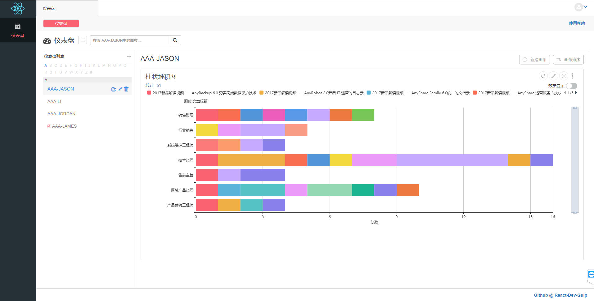

# React Dev redux

一个简单完整的前端开发脚手架



## 写在前面
该项目我一接手代码就已经写得很糟糕啦，但是项目架构还是容易理解的，适合新人快速学习前端项目架构，并发现项目中的不足，然后在此基础上进行调整与自我提升。以下我先列出部分需要改进的地方。
* css代码统一放在style文件中而且没有使用import导入，项目过大有时很难找到对应的文件。(推荐按功能模块组织)
* 代码经过不同程序员编写，代码风格没有统一。(eslint)
* 开发环境在项目体积变大时，重新编译会很慢。(webpack编译代码时没有做热更新)
* 项目路由没有做全面，很多页面刷新就会出现跳转，而且会造成组件过于复杂。
* reflux框架没有做到真正的状态管理仅仅充当了发布和订阅的功能，更多应用参考官方文档。
* 封装了Ajax，但是没有考虑真实的网络情况。

更现代的前端开发脚手架@[React-Dev](https://github.com/Tianlikai/React-Dev)

## 编译说明
> 新版本我们开始使用dll的方式加载第三方组件
> 在编译流程上会有些许变化

## 文件目录
```
├── node_modules:               模块文件夹
|   └── ...
├── production:                 打包生成目录
|   ├── dist:                   打包文件
|   ├── help:                   帮助文档
|   ├── index.html:             打包html
├── public:                     开发环境
|   ├── app:                    app文件夹
|   |   ├── actions:            API请求
|   |   ├── common:             公共文件
|   |   ├── component:          页面组件
|   |   ├── data:               配置数据信息
|   |   ├── jComponent          页面组件
|   |   ├── lang:               国际化 
|   |   ├── mock:               模拟数据
|   |   ├── styles:             样式
|   |   └── app.js:             项目入口、路由组件
|   ├── dist:                   开发环境打包文件
|   └── index.html:             开发环境html
├── .babelrc                    babel配置文件 
├── dll.config.JS               DLLPlugin config 文件
├── Dockerfile                  docker文件
├── gulpfile.JS                 gulp构建流文件
├── nginx.conf                  nginx配置文件
├── package.json                项目依赖 npm
├── README.MD                   项目信息
├── template.html               html模板
├── vendor-manifest.json     
└── webpack.config.js           webpack配置文件
```
## 技术栈
* react
* react-dom
* react-router ^2.5.2
* reflux 数据流
* gulp 项目构建、文件压缩
* webpack babel转译、代码分割、公共文件独立提取
* ESLint 代码规范 
* mockjs 模拟接口数据

## 公共插件
* echarts ^3.7.1
* react-table ^6.5.3
* react-modal-bootstrap 1.0.0

## 开发环境
* 下载nginx
* 更改nginx.conf文件 指向当前文件

## 编译步骤
* npm install 所有的依赖包
* gulp clean_vendor 清除vendor文件 公共依赖库变更执行命令
* webpack --config ./dll.config 生成vendor-manifest.json文件和app.vendor.js文件
* gulp min_vendor 压缩dll编译文件
* gulp clean 清除开发环境打包文件
* gulp c 清除所有打包文件
* gulp 开发环境打包
* gulp server 打开开发环境热更新功能
* gulp c -> gulp p 打包为发布文件

> **注意：**以上步骤为在第一次初始化，只有在依赖的第三方库方式变动时，才需要执行以上三步。
> **本地开发**只需执行**最后一步**操作即可
> 即 ```gulp```
